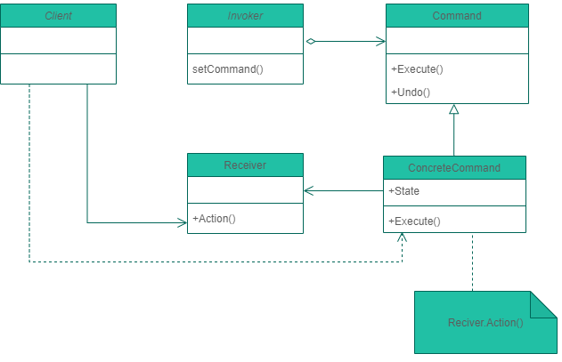

# Command Pattern 命令模式

### 命令模式將「請求」封裝成物件，以便使用不同的請求、佇列、或者日誌，參數化其他物件。命令模式也支援可復原的作業。

- Client (負責建立 具體命令 並組裝 接收者):

	`建立具體的命令物件 (ConcreteCommand)，並設定其接收者 (Receiver)，此處的 Client 是站在『命令模式』的立場，而非泛指的『客戶』`

- Invoker (負責儲存與呼叫命令):

	`儲存具體的命令物件 (ConcreteCommand) ，並負責呼叫該命令 —— ConcreteCommand.Execute()，若該 Command 有實作 『復原』功能，則在執行之前，先儲存其狀態(ModifyPrice)`

- Command (負責制定命令使用介面):

	`如其名，是此模式的關鍵之處 。『至少』會含有一個 Execute() 的抽象操作 (方法) (abstract operation)(ICommand)`

- Receiver (負責執行命令的內容):

	`知道如何根據命令的請求，執行任務內容，因此任何能實現命令請求的類別，都有可能當作 Receiver(Product)`

- ConcreteCommand (負責呼叫 Receiver 的對應操作):

	`具體的命令類別，通常持有 Receiver物件(ProductCommand)`

#### Command
<pre>
<code>
public interface ICommand
{
    void ExecuteAction();
    void UndoAction();
}
</code>
</pre>

#### Invoker
<pre>
<code>
public class ModifyPrice
{
    private readonly Stack<ICommand> _commands; //所有命令
    private ICommand _command;//單一命令

    public ModifyPrice()
    {
        _commands = new Stack<ICommand>();
    }

    public void SetCommand(ICommand command) => _command = command;

    public void Invoke()
    {
        _commands.Push(_command);
        _command.ExecuteAction();
    }

    public void Undo()
    {
        if (_commands.Count == 0)
        {
            Console.WriteLine("[復原失敗] --- 查無記錄");
            return;
        }
        var cmd = _commands.Pop();
        cmd.UndoAction();
    }
    public void UndoAll()
    {
        // 依序取消
        foreach (var command in _commands)
        {
            command.UndoAction();
        }
    }
}
</code>
</pre>

#### Receiver
<pre>
<code>
public class Product
{
    public string Name { get; set; }
    public int Price { get; set; }

    public Product(string name, int price)
    {
        Name = name;
        Price = price;
    }
    public void IncreasePrice(int amount)
    {
        Price += amount;
        Console.WriteLine($"商品:[{Name}] , 價格:+ {amount}.");
    }
    public void DecreasePrice(int amount)
    {
        if (amount < Price)
        {
            Price -= amount;
            Console.WriteLine($"商品:[{Name}] , 價格:- {amount}.");
        }
    }
    public override string ToString() => $"商品:[{Name}] , 價格={Price}.";
}
</code>
</pre>

#### ConcreteCommand
<pre>
<code>
public enum PriceAction
{
    Increase,
    Decrease
}

// 設定要執行的命令
public class ProductCommand : ICommand
{
    private readonly Product _product;
    private readonly PriceAction _priceAction;
    private readonly int _amount;

    public ProductCommand(Product product, PriceAction priceAction, int amount)
    {
        _product = product;
        _priceAction = priceAction;
        _amount = amount;
    }

    public void ExecuteAction()
    {
        if(_priceAction == PriceAction.Increase)
        {
            _product.IncreasePrice(_amount);
        }
        else
        {
            _product.DecreasePrice(_amount);
        }
    }
    public void UndoAction()
    {
        if (_priceAction == PriceAction.Increase)
        {
            _product.DecreasePrice(_amount);
        }
        else
        {
            _product.IncreasePrice(_amount);
        }
    }
}
</code>
</pre>

<pre>
<code>
static void CommanPattern_market()
{
    var modifyPrice = new ModifyPrice();// Invoker 發命令物件
    var CurrentPrice = 30000;
    var product = new Product("iPhone 13", CurrentPrice);// Reciver 執行命令物件

    Console.WriteLine(product);
    Execute(modifyPrice, new ProductCommand(product, PriceAction.Increase, 100));
    Execute(modifyPrice, new ProductCommand(product, PriceAction.Increase, 50));
    Execute(modifyPrice, new ProductCommand(product, PriceAction.Decrease, 25));
    Execute(modifyPrice, new ProductCommand(product, PriceAction.Increase, 70));
    Console.WriteLine(product);
    Console.WriteLine("====回復====");
    //modifyPrice.UndoAll();
    modifyPrice.Undo();
    modifyPrice.Undo();
    modifyPrice.Undo();
    modifyPrice.Undo();
    modifyPrice.Undo();
    Console.WriteLine(product);
}
private static void Execute(ModifyPrice modifyPrice, ICommand productCommand)
{
    modifyPrice.SetCommand(productCommand);
    modifyPrice.Invoke();
}
</code>
</pre>

Result:

	商品:[iPhone 13] , 價格=30000.
	商品:[iPhone 13] , 價格:+ 100.
	商品:[iPhone 13] , 價格:+ 50.
	商品:[iPhone 13] , 價格:- 25.
	商品:[iPhone 13] , 價格:+ 70.
	商品:[iPhone 13] , 價格=30195.
	====回復====
	商品:[iPhone 13] , 價格:- 70.
	商品:[iPhone 13] , 價格:+ 25.
	商品:[iPhone 13] , 價格:- 50.
	商品:[iPhone 13] , 價格:- 100.
	[復原失敗] --- 查無記錄
	商品:[iPhone 13] , 價格=30000.

## 結論

- Command Pattern可以將擁有複雜邏輯的物件與樹狀關係解耦
- 可以重複使用不同的Command組裝成新的邏輯結構
- Command可以透過迭代方式執行