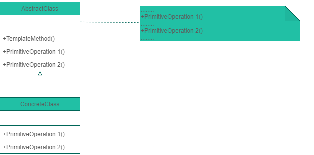

# Template Method Pattern 範本方法模式

- 範本方法模式將一個演算法的骨架定義在一個方法中，而演算法本身會用到的一些方法，則是定義在次類別中。樣板方法讓次類別在不改變演算法架構的情況下，重新定義演算法中的某些步驟。
- 模板方法是一個定義在父類別的方法，在模板方法中會呼叫多個定義在父類別的其他方法，而這些方法有可能只是抽象方法並沒有實作，模板方法僅決定這些抽象方法的執行順序，這些抽象方法的實作由子類別負責，並且子類別不允許覆寫模板方法。
- Template Method需要開發抽象類別和具體子類的設計師之間的協作。一個設計師負責給出一個演算法的輪廓和骨架，另一些設計師則負責給出這個演算法的各個邏輯步驟。代表這些具體邏輯步驟的方法稱做基本方法（primitive method）；而將這些基本法方法總匯起來的方法叫做模版方法（template method）。
- 那演算法透過了樣板方法帶給我們什麼好處？
	1. 透過超類別保護演算法，因演算法只存在超類別，容易修改。(超類別專注在演算法本身)
	2. 次類別的程式碼再用性極大，由次類別來實踐完整的程式碼

假設開了一家飲料店,泡咖啡跟泡茶的SOP如下
<html>
<table style="width:100%">
<tr>
<td>
<pre>
<code>
public class Coffee {
    // 這是店裡統一的泡咖啡SOP
    void prepareRecipe()
    {
        // 煮開水
        boilWater();

        // 用沸水沖泡咖啡
        brewCoffeeGrinds();

        // 把咖啡倒進杯子
        pourInCup();

        // 加糖和牛奶
        addSugarAndMilk();
    }
    // 底下省略這些方法的實作...
}
</code>
</pre>

</td>
<td>
<pre>
<code>
public class Tea {
    // 這是店裡統一的泡茶SOP
    void prepareRecipe()
    {
        // 煮開水
        boilWater();

        // 用沸水沖泡茶包
        steepTeaBag();

        // 把茶倒進杯子
        pourInCup();

        // 加檸檬
        addSLemon();
    }
    // 底下省略這些方法的實作...
}
</code>
</pre>
</td>
</tr>
</table>
</html>

prepareRecipe看起來好像喔，應該可以抽象化。第一步很自然的把一些一樣的方法，如biolWater 跟 pourInCup，放到超類別裡，就稱為 Beverage。而雖然咖啡是沖泡「咖啡」、加糖跟牛奶，茶是沖泡「茶葉」、加檸檬，兩種飲料加的東西不一樣，但是做的「動作」是一樣的，只是處裡不同的原料而已。有了這些想法後，就可以來改上面的程式碼了：
<pre>
<code>
// 抽象類別-飲料
public abstract class Beverage {

    // 宣告為 final 是因為不想次類別推翻這個方法, 這是統一的演算法
    final void prepareRecipe()
    {
        // 煮開水
        boilWater();

        // 用沸水沖泡
        // 跟上面程式碼比, 方法名更通用
        brew();

        // 把飲料倒進杯子
        pourInCup();

        // 加配料
        // 跟上面程式碼比, 方法名更通用
        addCondiments();
    }

    // 因為咖啡跟茶處理這些方法的做法不同,
    // 所以宣告為抽象方法,
    // 留給次類別去處理
    abstract void brew();
    abstract void addCondiments();

    private void boilWater()
    {
        // 不管是茶或咖啡做法都一樣
        // 可以直接把實作寫在超類別
    }

    private void pourInCup()
    {
        // 不管是茶或咖啡做法都一樣
        // 可以直接把實作寫在超類別
    }
}
</code>
</pre>
茶與咖啡實作
<html>
<table style="width:100%">
<tr>
<td>
<pre>
<code>
public class Tea : Beverage {

    public override void brew()
    {
        System.out.println("泡茶");
    }

    public override void addCondiments()
    {
        System.out.println("加檸檬片");
    }
}
</code>
</pre>
</td>
<td>
<pre>
<code>
public class Coffee : Beverage {

    public override void brew()
    {
        System.out.println("通過過濾器滴咖啡");
    }

    public override void addCondiments()
    {
        System.out.println("加糖,牛奶");
    }
}
</code>
</pre>
</td>
</tr>
</table>
</html>
樣板方法除了上面的範例外，還有一個小技巧可以用，稱為掛鉤(Hook)。掛鉤是一種方法，被宣告在抽象類別中，且定義為什麼都不做，或是有預設的實作方式。這可以讓次類別有能力對演算法進行掛鉤。要不要掛鉤則由次類別決定
<pre>
<code>
public abstract class BeverageWithHook
{

    public void prepareRecipe()
    {
        boilWater();//燒開水
        brew();//沖泡
        pourInCup();//倒入杯子

        // 加上一個判斷式, 如果客戶
        // 想要配料才真的加配料
        if (customerWantsCondiments())
        {
            addCondiments();
        }
    }

    /// 

    /// 沖泡
    /// 

    public abstract void brew();
    
    /// 

    /// 加調味
    /// 

    public abstract void addCondiments();

    /// 

    /// 燒開水
    /// 

    private void boilWater()
    {
        // 不管是茶或咖啡做法都一樣
        // 可以直接把實作寫在超類別
        Console.WriteLine("燒開水");
    }
    /// 

    /// 倒入杯子
    /// 

    private void pourInCup()
    {
        // 不管是茶或咖啡做法都一樣
        // 可以直接把實作寫在超類別
        Console.WriteLine("倒入杯子");
    }

    /// 

    /// 顧客加料
    /// 

    /// <returns></returns>
    public virtual bool customerWantsCondiments()
    {
        // 這就是一個掛鉤, 通常是空的實作。
        // 次類別可以推翻(Override) 它,
        // 但不見得要這麼做
        return true;
    }
}
</code>
</pre>

假如要使用掛鉤，次類別要推翻預設的定義，此範例的掛鉤是控制是否要加配料，我們可以在次類別決要怎樣的情形才會加配料：
<pre>
<code>
public class CoffeeWithHook : BeverageWithHook
{
    public override void brew()
    {
        Console.WriteLine("通過過濾器滴咖啡");
    }
    public override void addCondiments()
    {
        Console.WriteLine("加糖,牛奶");
    }
    public override bool customerWantsCondiments()
    {
        Console.WriteLine("顧客是否要加料?(y/n)");
        // 推翻掛鉤方法, 改成自己想要的行為
        string answer = getUserInput();
        if (answer.ToLower().StartsWith("y"))
        {
            return true;
        }

        return false;
    }
    private string getUserInput()
    {
        // 省略從標準 I/O 取得使用者輸入...
        return Console.ReadLine();
    }
}
</code>
</pre>

Result:

	=====================
	Coffee TempleteMethod.
	=====================
	燒開水
	通過過濾器滴咖啡
	倒入杯子
	顧客是否要加料?(y/n)
	y
	加糖,牛奶
	
	=====================
	Tea TempleteMethod.
	=====================
	燒開水
	泡茶
	倒入杯子
	顧客是否要加料?(y/n)
	y
	加檸檬片